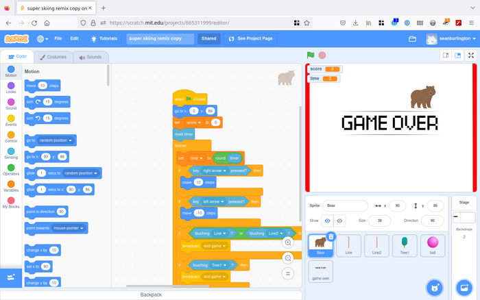
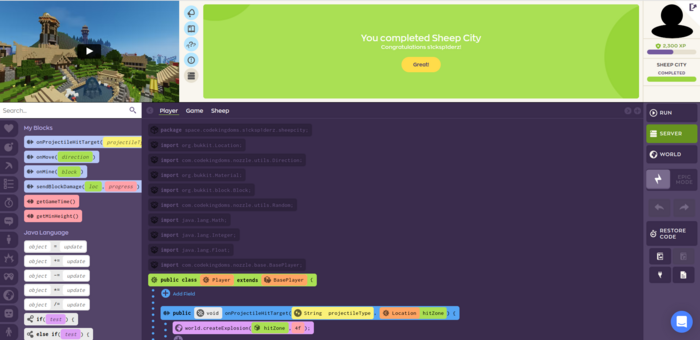
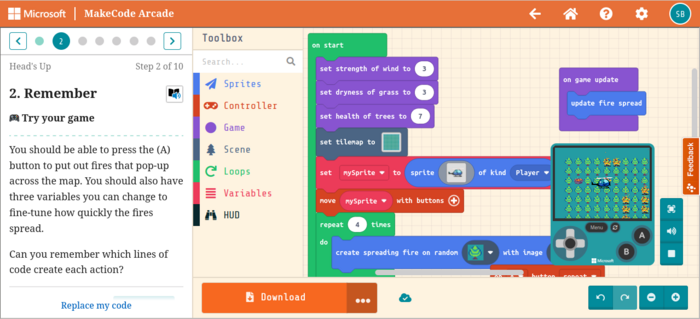

I grew up during the home computing revolution of the 80s when lot's of kids like me persuaded our parents we _needed_ a computer to learn programming - we actually just wanted to play games - but the joke was on us as we ended up getting sucked into coding anyway.

Games are so much better these days - but also so much more packaged - so how do you get kids into coding ?

There are so many options to choose from.

My son is 10, loves Minecraft, Roblox, and Fortnite - plays on Xbox and Android 

TLDR - go with [MakeCode]()
<!--more-->

All the platforms we explored use a "block" coding interface which is a very visual way of representing loops, conditionals and the other structures of code. You drag and drop code elements into structures instead of writing code as text.

## Scratch 

We started with [Scratch](https://scratch.mit.edu/) and there is a lot to love about it 

We liked these [tutorials from the Raspbery Pi Foundation](https://projects.raspberrypi.org/en/paths)

### Pros

There are a lot of tutorials around

Scratch allows you to use your own photos and sounds - which can be a lot of fun - use photo's of yourself and be the character in your own game.

If you use a Raspberry Pi Scratch is an easy way to use code to interface with the real world (make something like this [wire loop game](https://projects.raspberrypi.org/en/projects/rpi-wire-loop-game-scratch/)

People make some really sophisticated games and share them via the [vibrant scratch community](https://scratch.mit.edu/discuss/) 

Generally great for first steps

### Cons

I found we spent a lot of time working out if objects in the game had collided while getting everything to refresh and stay in sync 

No onward path the "proper" coding using text instead of blocks.

## Code Kingdoms

[Code Kingdoms](https://codekingdoms.com/plans) costs from £15 per month to £250 for a lifetime package

It aims to teach coding for both Roblox and Minecraft

You have to install a small plugin for Roblox but then get to make games you can share with friends.

The Minecraft version relies on the Code Kingdoms server - they have some clever tooling to make Minecraft modding easier but it only works on their server - so you can invite friends to play the games you make - but only on the Code Kingdoms server.

It's awesome in many ways - the tutorials are set up so that the kid follows some relatively easy steps and gets a cool game out of it.

The coding interface is all via the browser - which is easy but we found the video too small - and having two browser windows open (one to watch the video and the other to write code in)  kinda worked but got confusing.

But the big problem is that the tutorials are all by video.

So you have to follow complex instructions in real time - if you miss a bit and the code doesn't work it's really hard to keep going back and finding the step you missed.

In the end this just killed it for us - we paid for a years subscription and gave up on it.

Also - the coding interface looks like blocks - but is much more like regular code and isn't as kid-friendly.

Code Kingdoms: we'd come back if you provided written tutorials.

##  MakeCode

I love MakeCode. Instead of trying to do everything in one package there is a common core code block editor - but then specialised options for games, [Microbit](https://microbit.org/), or Minecraft (kinda)

It all works in the browser and is completely free.

The tutorials are great, step by step instructions synchronised with the code editor so that the graphics you need are pre-loaded and you start with a more limited set of commands to choose from - which makes getting started easier.

Being able to replace your code with their example is great - it means a 
mistake made early on doesn't have to hold you back (fixing bugs is half the challenge - but being able to skip it sometimes helps motivation).

The code commands are specific to gaming - so there are commands for sprites, projectiles, collisions, game over, high score etc 

Graphics and sounds are basic (or retro) but editing them is easy - and the level editor is great.

This means you get to spend most of your time thinking about making the gameplay - there is already a basic game engine for you to use.

The blocks code editor is a great starting point - but ultimately code is a text thing - and MakeCode can switch between blocks, JavaScript and Python - which is great for moving on later.

Once you have written the game you can share it online or play on a [real console](https://kitronik.co.uk/products/5311-arcade-for-makecode-arcade). We got one of these and somehow it made it all feel so much more real.

I'm not so convinced by [MakeCode Minecraft](https://minecraft.makecode.com/) - it just didn't seem so much fun and didn't seem to be quite making Minecraft mods - but maybe we will look at it again.

I do like [the microbit code](https://makecode.microbit.org/) it's really easy and means you can interact with the real world. 

We made one of these [inchworms](https://makecode.microbit.org/projects/inchworm)

## Summary 

Have fun with MakeCode (it's free)

I'd recommend starting with [arcade](https://arcade.makecode.com/) - make some games 

If you like it buy a [console](https://kitronik.co.uk/products/5311-arcade-for-makecode-arcade)

If you want to do some electronics get a [Microbit](https://thepihut.com/products/micro-bit-v2-go-starter-kit) and I'd really reccomend something like this [inventors kit](https://thepihut.com/products/inventors-kit-for-the-bbc-micro-bit)

You can go a long way with block coding - if you really enjoy it you may want to start doing some JavaScript coding later on and the transition should be pretty easy - but you'll know more about it by then.

